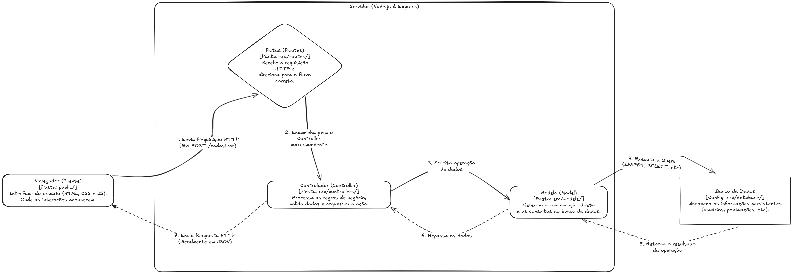

# 🗡️ Shadow Slave Project


Aplicação web desenvolvida no padrão MVC (Model-View-Controller) para gerenciamento de usuários e sistema de jogo.

<div align="center">  </div>
<div align="center" >


</div>
<div align="center" >


</div>
<br>

🔗 **Links Úteis:**
* [Documentação de Escopo e Requisitos](https://bandteccom-my.sharepoint.com/:w:/g/personal/jhoel_mita_sptech_school/IQBliekllwnlRK-s8dLnT0i3AanPjIKroSmJP6ROe6ViFyY?e=ad4jVy)
* [Apresentação Executiva (Slides)](https://canva.link/wwcsesweydbhp8p)
* [Repositório do Banco de Dados (Scripts SQL)](https://github.com/JhoelDiego2/shadow_slave_banco/blob/main/Arquivos_Sql_Servidor/01_scriptbanco.sql)
* [Site estatico](https://shadow-slave-projeto.vercel.app/)
* [Protótipo no figma](https://www.figma.com/design/frLpg3PeeuufFIJGKqezuV/Projeto_definitivo?node-id=0-1&t=XrTYFsDKielO3pnb-1)
* [Dicas projeto individual](sptecher.md)


---

## 🏗️ Arquitetura do Sistema

Abaixo está o diagrama de funcionamento da aplicação (Contexto e Integrações):

>  

**Fluxo de Funcionamento:**
1. O cliente interage com os arquivos estáticos (`HTML/CSS/JS`) na camada de **View**.
2. As requisições são enviadas para a **API (Node.js/Express)** através das rotas (`src/routes`).
3. O **Controller** processa a regra de negócio e aciona o **Model**.
4. O **Model** se comunica com o banco de dados relacional para persistência de dados.

---

## 🛠️ Stack Tecnológica

* **Backend:** Node.js, Express.js
* **Frontend:** HTML5, CSS3, JavaScript Vanilla
* **Infraestrutura:** Docker
* **Banco de Dados:** (Ex: MySQL / SQL Server) - *Ver repositório de DB*

---

## 📂 Estrutura do Projeto

A organização segue o padrão arquitetural MVC. *(Nota: A pasta de `assets` não está versionada neste repositório devido ao tamanho dos arquivos de mídia).*

```text
📦 shadow-slave-projeto
 ┣ 📂 public          # View: Arquivos estáticos (HTML, CSS, JS do cliente)
 ┣ 📂 src
 ┃ ┣ 📂 controllers   # Controllers: Lógica de negócio e intermediação
 ┃ ┣ 📂 database      # Configurações de conexão (config.js)
 ┃ ┣ 📂 models        # Models: Consultas e manipulação do banco de dados
 ┃ ┗ 📂 routes        # Rotas da API (game.js, usuarios.js, index.js)
 ┣ 📜 app.js          # Arquivo de inicialização do servidor
 ┣ 📜 Dockerfile      # Configuração para containerização da aplicação
 ┗ 📜 package.json    # Dependências do projeto
````

-----

## 🚀 Como Executar

### Pré-requisitos

  * Node.js (v14+)
  * Docker (Opcional, para rodar via container)
  * Banco de Dados configurado (conforme [repositório de DB](https://www.google.com/search?q=link_aqui_do_banco))

### Rodando Localmente

1.  Clone o repositório:

<!-- end list -->

```bash
git clone [https://github.com/seu-usuario/shadow-slave-projeto.git](https://github.com/seu-usuario/shadow-slave-projeto.git)
```

2.  Instale as dependências:

<!-- end list -->

```bash
npm install
```

3.  Configure as variáveis de conexão do banco em `src/database/config.js`.
4.  Inicie o servidor:

<!-- end list -->

```bash
npm start
```

*A aplicação estará disponível em `http://localhost:3333` (ou a porta definida no app.js).*

### Rodando via Docker

```bash
docker build -t shadow-slave-app .
docker run -p 3333:3333 shadow-slave-app
